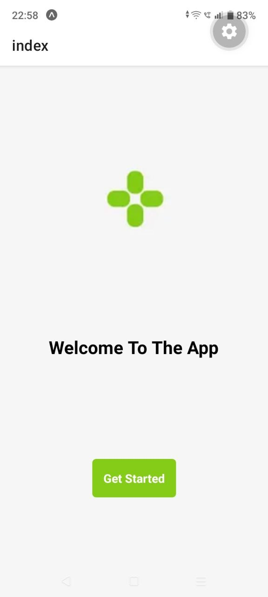
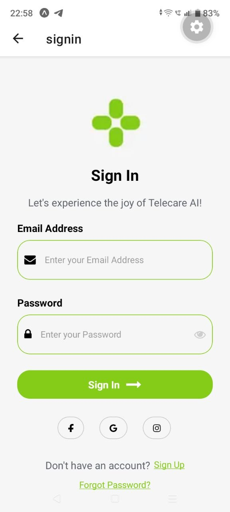
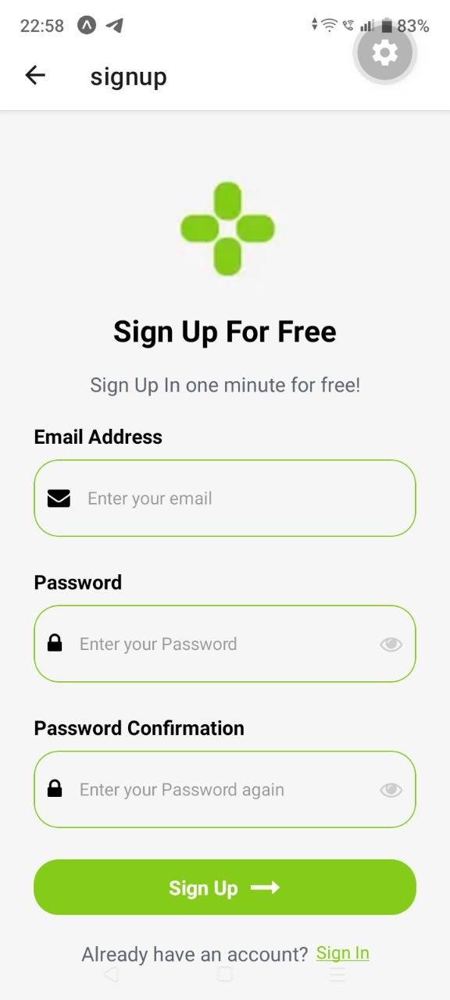
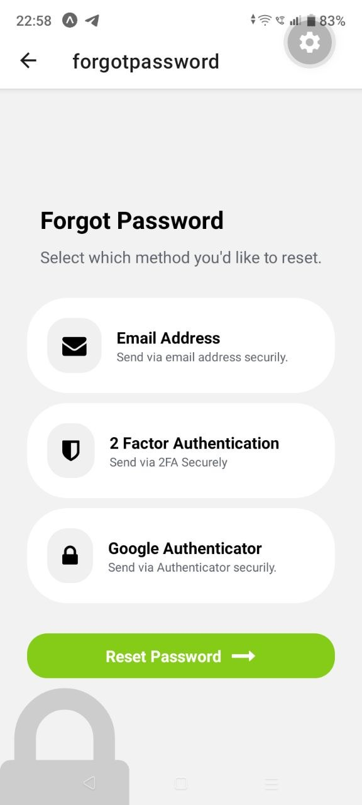

# React Native Sign In Screen

A modern and responsive mobile authentication screen built using **React Native** and **Expo**.  
This project recreates a clean and elegant Sign In UI inspired by a professional Dribbble mobile design.

---

# 📱 App Preview








---

# ✨ Features

- Modern mobile Sign In interface
- Responsive layout for mobile devices
- Email input field
- Password input field
- Sign In button
- Social login buttons
- Forgot Password option
- Sign Up navigation text
- Clean spacing and typography
- Built using only core React Native components

---

# 🛠️ Technologies Used

- React Native
- Expo
- JavaScript

---

# 📂 Folder Structure

```bash
react-signin/
│
├── assets/
├── App
├── package.json
├── README.md
└── node_modules/
```

---

# 🚀 Installation & Setup

## 1. Clone the Repository

```bash
git clone https://github.com/SUSHRUTO/React-Signin.git
```

---

## 2. Navigate to Project Directory

```bash
cd React-Signin
```

---

## 3. Install Dependencies

```bash
npm install
```

---

## 4. Start Expo Development Server

```bash
npx expo start
```

---

## 5. Run the App on Mobile

- Install **Expo Go** on your Android or iOS device
- Connect your phone and laptop to the same WiFi network
- Scan the QR code generated by Expo
- The app will open automatically on your device

---

# 🎯 Project Objective

The purpose of this project is to practice:

- React Native UI development
- Mobile layout structuring
- Responsive design implementation
- Component organization
- Real-world mobile screen recreation from design references

---

# 🎨 Design Reference

Dribbble Design Reference:

https://dribbble.com/shots/24783022-osler-AI-Telehealth-Telemedicine-App-Sign-In-Sign-Up-UI

---


---

# 👨‍💻 Author

**Sushruto Majumdar**

---

# 📄 License

This project is developed for educational and assignment purposes only.